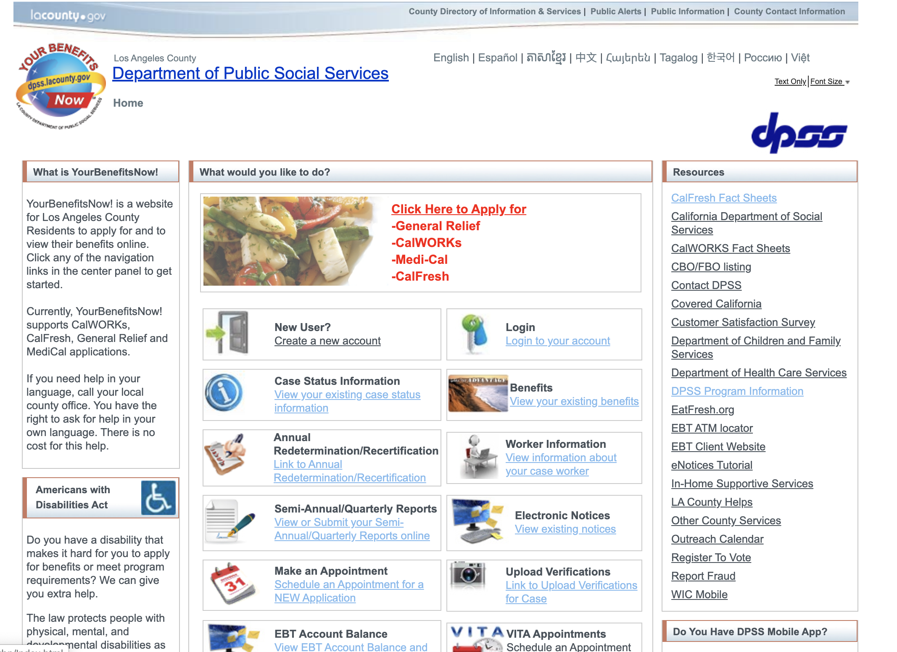
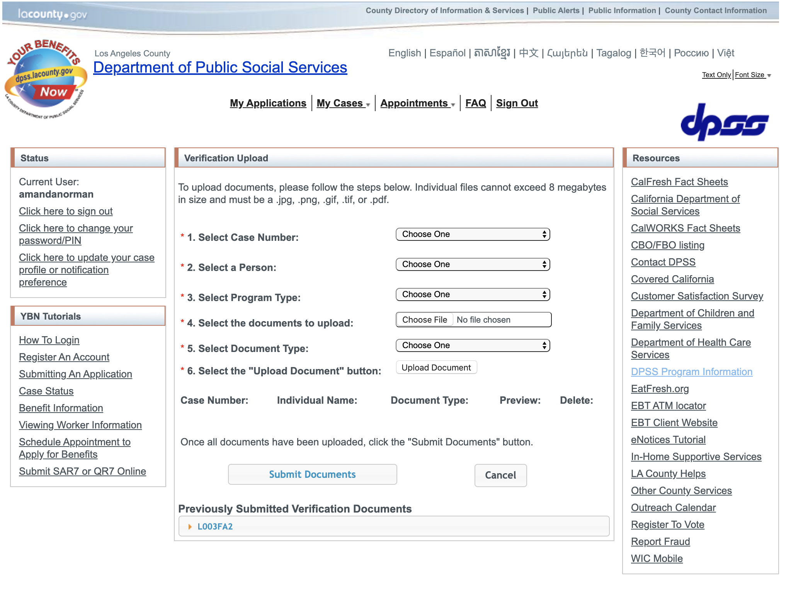

# Usability of LA Public Services
## DH150 Assignment 1: Heuristic Evaluation by Amanda Norman
There are many public services that are available to Los Angeles residents, but many may not be very accessible due to the usability and functionality of their websites. Because the internet is a powerful, useful, and relevant digital tool for the modern age, I want to explore ways we can make public resources user-friendly and accessible via the internet.
## Website 1: YourBenefitsNow - LA County Department of Public Social Services 
https://www.yourbenefits.laclrs.org/ybn/Index.html/

YourBenefitsNow is a service from the Los Angeles County Department of Public Social Services (DPSS) that allows people who receive services from the department to apply for benefits and view the status of their benefits. It is an important government service that helps people view and manage their government benefits.

My initial overall evaluation of this website is that there is a lot of information and a lot of links on every page, which may make navigating the site overwhelming for users. The navigation bar itself, though, does not have many choices, so that may indicate the most important tasks and information that users come to the site for.

## Website 2: The Hammer Museum
https://hammer.ucla.edu/

The Hammer Museum serves the community by offering free admission to view its exhibitions and collections, as well as free programs and events that the community can participate in. My initial evaluation of the website is that it looks fairly minimalistic and aesthetically pleasing, but still has a lot of information to offer. I wish that the main headers featured drop-down menus so that I could more quickly navigate to subpages.

## Severity Ratings Scale
1 = Cosmetic problem only: need not be fixed unless extra time is available on project
2 = Minor usability problem: fixing this should be given low priority
3 = Major usability problem: important to fix, so should be given high priority

Source: https://www.nngroup.com/articles/how-to-rate-the-severity-of-usability-problems/

## 1. Visibility of System Status

### YourBenefitsNow

After using the navigation bar to access a certain web page, the website only tells the user what page they are on, but does not show users what pages led to that exact page. Users are not able to see the steps they took to get to a certain page.
Severity: (2)

The website shows, “current status” on the left-hand side, accompanied by the current account that is logged in. However, it does not show the status of their government case and their benefits.
Severity: (1)

### Hammer
When mousing over a heading, the heading color only changes slightly, from a dark grey to a lighter gray. This may be difficult for users with vision troubles to see what heading they are about to select and ensure that they are clicking on what they intend to click on. However, after clicked, the heading color changes to blue, indicating what page the user is on. Severity: (1)

## 2. Match between system and the real world

### YourBenefitsNow
There is a function for users titled, “Message Board.” The function of this page is not clear, as message boards typically involve threads of people messaging back and forth. The page itself doesn’t give users an option to send a message, so the name for this page is misleading. A better name for this might be “Inbox.”
Severity: (2)

### Hammer
The use of both “Exhibition” and “Collection” may confuse users who are not well-educated about how art museums organize their art material, as both refer to art that the museum has featured or is featuring. Some links appear on both pages, so users may have trouble understanding the difference between the two headings. 
Severity: (1)

## 3. User Control and Freedom

### YourBenefitsNow
Since the website does not show users the path that was taken to reach a certain page (see heuristic 1), users cannot easily navigate back to a specific page. 
Severity: (2)

Users cannot easily access the Home Page Menu. I would expect to easily navigate back to the Home Page (picture 1) either by clicking the globe logo in the upper-left or by clicking the large link in the upper-left that says, “Department of Public Social Services” since it is in an area where users would expect to find logos and home pages. However, when clicking the logo, users are immediately taken back to a sign-in page and forced to sign-in all over again. 

When clicking the “Department of Public Social Services” link, users are taken to an entirely separate webpage -- the main website for the Los Angeles County Department of Public Social Services. Moreover, this separate webpage does not open in a new window, so users either have to click the backspace arrow or figure out how to get to the YourBenefitsNow website from the new page.
Severity: (3)

When uploading a document for verification, users cannot undo or unsubmit a document once they have uploaded it. Users cannot even see what document they uploaded. This means that users have to be very careful and certain that they are submitting the correct documents and filling out all fields correctly because the website does not allow them to view or fix their mistakes.
Severity: (2) 

###	Hammer
The Hammer Museum website also does not show users their path to a certain page, so it is not easy for users to exit a page they are on and go directly to a page they were on previously. The only way for them to do this is by clicking the backspace arrow.
Severity: (1)

For example, when clicking on “View All Digital Archives,” and then on a collection within digital archives, users do not have a clear way to get back to the initial collections page if they decide they do not want to view digital archives.

## 4. Consistency and Standards

### YourBenefitsNow
The website violates external consistency by NOT having the logo OR the large link in the upper-left corner navigate back to the main page/menu of the website. As mentioned in heuristic 3, clicking on the logo navigates users to a page prompting them to log in again completely, rather than be taken back to the main page that users see when they initially log in. 

Additionally, clicking the large link that says, “Department of Public Social Services” redirects users to an entirely different website, rather than the main page of the current website. This violates external consistency because most websites typically have their logotype in the upper-left that allows users to go to the homepage, so users expect that to happen on this website. 
Severity: (3)

###	Hammer
The Hammer’s website does a pretty satisfactory job at maintaining both internal and external consistency. Colors of headings and selections are consistent and maintained throughout the website. The magnifying glass, a commonly used icon for a search function, indicates a search bar in the upper right corner of the site, where most users would expect to find a search bar. Also, a commonly-used icon indicating a menu is used for the website’s menu function.
Severity: (1)

## 5. Error Prevention

###	YourBenefitsNow
When submitting documents for verification, users are not prompted to review all materials before submission. When clicking, “Submit Documents,” the documents are automatically submitted right away. As a result, users are not given a second chance or a reminder to ensure they filled out all fields correctly, even if they accidentally click “Submit Documents.” This is very unhelpful, especially because once a document is submitted, users cannot un-submit or view the submitted documents.
Severity: (2)

###	Hammer
I tried making an online donation of $0.01 to the Hammer, and after clicking “Donate Now,” the only thing that barred me from completing the donation was that the minimum donation had to be $1.00. However, the website did not ask me to review my details to ensure they were correct or ask me if I was certain I wanted to donate. This could be dangerous for users who may have input the wrong amount or incorrect address and did not double-check the information they provided.
Severity: (1)

## 6. Recognition rather than recall

### YourBenefitsNow
The website does a satisfactory job at this heuristic, as it provides a menu with dropdown headers, reminding users of what they may have come to the website for and the functions that are available. However, as previously mentioned, users cannot view their path to any specific webpage, so each time they want to reach a webpage they may have visited before, they have to recall how they got there.
Severity: (1)

###	Hammer
Similar to the YourBenefitsNow website, the Hammer does a satisfactory job at providing users with a clear navigation bar with headings and a menu of pages that users can choose to go to. However, users are also not given a navigation path to any webpage, so they need to remember all the steps they took to get to any given page.
Severity: (1)

## 7. Flexibility and Efficiency of use

###	YourBenefitsNow
The website is not very flexible or efficient, as there is only one way to get to the pages in the menu. The website does not even have a search bar.
Severity: (2)

###	Hammer
The website does have a search function, which may be more efficient for when users want to find a specific page and they do not have to search through the menu and headings to find it. 
Severity: (1)

The search results allow users to filter to get more precise results, but do not allow users to sort the results by relevance, date of posting, etc. The absence of a sort function may make the site less efficient and flexible for users who are looking for something of a specific date, keyword, etc.
Severity: (2)

## 8. Aesthetic and Minimal Design

###	YourBenefitsNow
The website has many links on the sides that are unnecessarily visible no matter what page you go to. The content the user has navigated to appears in the middle of the screen, but the “Resources” and “YBN Tutorials” side panels and links within the panels remain. This is the opposite of a minimal design and gives users many other things to look at and click on other than their immediate task.
Severity: (1)

###	Hammer
The Hammer’s website is pretty satisfactory regarding this heuristic, as the design is minimal, yet functional. There are not too many choices in the navigation bar, and it is nice that the Menu icon in the upper left is collapsable, so users can choose to see more options if they wish. The first photo on the Home page is a bit large and extends past the screen if the user is scrolled up to the top, so it would be nice to make it a bit smaller so the user could see the whole photo without scrolling, since it is the first photo on the website.
Severity: (1)

## 9. Help users recognize, diagnose, and recover from errors

###	YourBenefitsNow
The website does a satisfactory job helping users recognize their errors. For example, when submitting a verification upload while missing required fields, the site notifies users of exactly what they are missing.
Severity: (1)

###	Hammer
The Hammer website does a satisfactory job helping users recognize their errors as well. For example, when making a donation below the minimum amount, even while all other fields are correctly filled out, the website notifies users exactly what is wrong with the intended donation.
Severity: (1)

## 10. Help and documentation

###	YourBenefitsNow
The website does feature a side panel with links to video tutorials on how to perform certain tasks. There is also a frequently asked questions page in the navigation bar. However, both of these features are very limited and only give users a short list to choose from. There is no search bar, so users cannot search for help on tasks that may not be listed in tutorials or the FAQ. They would have to contact the DPSS office for help, but the contact information for the office isn’t even easily located or readily available. 
Severity: (2)

###	Hammer
The website does not include a help section or a frequently asked questions section, so it may be difficult for users to get help on a topic. It is nice that users can use the search bar to find help, but it may be a less direct way to receive help.
Severity: (2)
