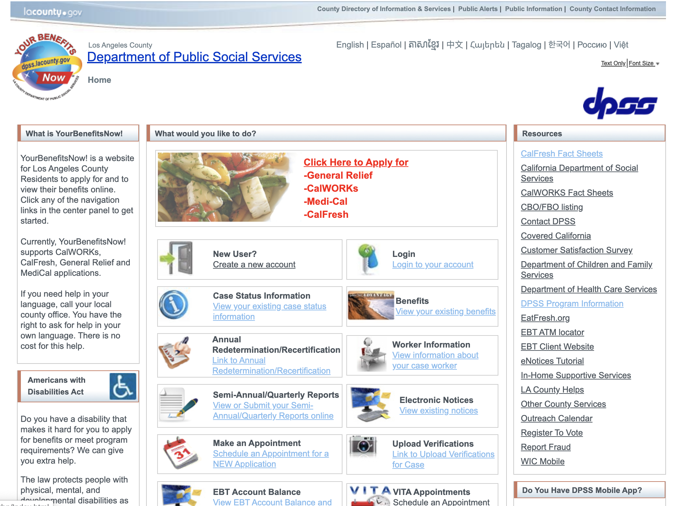

# YourBenefitsNow Website Redesign
## Amanda Norman

### Introduction
There are many public services that are available to Los Angeles residents, but many may not be very accessible due to the usability and functionality of their websites. Because the internet is a powerful, useful, and relevant digital tool for the modern age, I want to explore ways we can make digital public resources user-friendly and accessible to people of all backgrounds and abilities.

This project is a redesign of the YourBenefitsNow (YBN) website - a self-service portal from the Los Angeles Department of Public Social Services that allows users to view information and complete tasks related to their government benefits. It is an important public service that allows people to apply for, view and manage their government benefits, such as their case status, document submissions, benefit amount and electronic government notices regarding their case. The motivation for this redesign project is to improve various design features and update the aesthetic layout of the website to create a more enjoyable user experience.

### Design Statement
Many people's lives depend on government assistance, so the YourBenefitsNow (YBN) website is an essential service to those who need to apply or keep track of their benefits.  People who receive government assistance span a large range of ages, cultural backgrounds, abilities and socio-economic status. Therefore, it is really important that the YBN website is simple to navigate, available in multiple languages, and accessible to most people.

The current YBN website has an outdated aesthetic and can be overwhelming due to the amount of information and links on every page. Frequent tasks and information that need to be accessed are not very intuitive, especially to people with low technical literacy. My project of redesigning the Los Angeles Department of Public Social Services (DPSS) YourBenefitsNow website aims to support users by streamlining online access to important information about their public social service benefits, such as food stamp amount, case status, benefit applications, etc. I also aim to update the graphical user interface to make the website appear more modern and minimalist. In doing so, users’ experience with the service will be efficient, effective, and enjoyable, no matter their background or internet literacy.

### Competitor Analysis
#### Heuristic Evaluation

In order to assess its usability and pinpoint potential areas of improvement, I conducted a heuristic evaluation of the existing YBN website to compare its features to a set of usability standards. Through this evaluation, I found that the current YBN website’s adherence to these heuristics is merely satisfactory and there are several features in need of improvement.  [Read More...](https://github.com/amanda-norman/DH150-amandanorman/blob/master/Assignment01.md)

#### Usability Testing
The purpose of usability testing is to assess a website's interface and its usability, highlighting pain points for users. After conducting a heuristic evaluation of the existing YourBenefitsNow website, common usability issues included:

* No way of returning to the home page with a main menu of options
* The need to completely log in again every time a user clicks the YourBenefitsNow logo
* Lack of site path after navigating to certain pages, making it difficult to trace steps and return directly to a specific page
* Misleading links that direct to completely different webpages, positioned in places where the user would expect something different

I conducted a pilot usability test to evaluate how the design of the YourBenefitsNow website might affect a user's ability to perform basic tasks and functions that the website offers. View the pilot usability testing video below and [read more here.](https://github.com/amanda-norman/DH150-amandanorman/tree/master/Assignment02)

<iframe width="560" height="315" src="https://www.youtube.com/embed/6DTxtSfdIM0" frameborder="0" allow="accelerometer; autoplay; encrypted-media; gyroscope; picture-in-picture" allowfullscreen></iframe>

### User Research
To better understand users' past experiences and tailor the redesign to users' needs, I conducted contextual inquiry. I asked contextual background questions to gain a sense of the participant’s interaction with the website and observed the participant complete a few basic tasks on the website. I also asked the participant about any challenges they have experienced when using the website. This exercise helped me gather more insights from a different perspective about how a typical user navigates the website in hopes of creating a better user experience. [Read More...](https://github.com/amanda-norman/DH150-amandanorman/tree/master/Assignment04)

###  UX storytelling 
The purpose of UX storytelling is to gain a better understanding of typical, potential users of your product by empathizing with them. I imagined three different personas of users I might expect to use my product, visualizing how they might think, feel, and use the product. I thought of potential frustrations and motivations each user might have to try to gain a different perspective on how my website could be useful. This activity helped me expand my viewpoint outside myself by attempting to identify with the potential use cases of prospective users. 

#### 1. Kara

#### Kara's Journey Map

#### 2. Jonathan

#### Jonathan's Journey Map

#### 3. Brian

#### Brian's Journey Map

[Read More about my UX storytelling...](https://github.com/amanda-norman/DH150-amandanorman/tree/master/Assignment05)

### Wireframe and graphic design element variation 

#### Low-fidelity prototype 
The purpose of this low-fidelity prototype is to illustrate the re-imagined design of the YBN website that incorporates insights from my user research and improved design features.

After conducting user research, I created the following personas of typical users:
1. Working college students who need a quick and efficient way to access information about their benefits online
2. Low-income families and parents who have low technical literacy and need an interface that is simple to navigate and streamlines the process of applying for benefits and checking the status of benefits.

##### Features and Tasks
Based on my user research and personas, I created several features and potential tasks supported by this low-fidelity prototype that would meet the personas' needs.

###### Features
1. Choice of Language Prompt
* prompts users to choose their language before entering the site
* help non-English speakers feel more comfortable and capable of navigating the website upon entering

2. Dashboard Home Page and Simplified Navigation Menu
* reduces the amount of links and information on the main navigation menu of the website to make important functions, like finding EBT account balance and action items, easy to find
* makes the interface less cluttered and more minimalistic

3. "Action Required" Pop-up Notification
* lets users know when a mandatory action is needed for their account as soon as they log-in
* a streamlined way for users to complete those actions by adding a button that links them straight to the next step

4. Simplified Online Application Process
* a visible button on the Home Page that leads to the Benefit Application Process

###### Tasks
1. Choose language before entering the website.

2. Be notified of a mandatory action required, such as a mandatory document submission, then complete the action right away.

3. Check your EBT Account Balance and Monthly Deposits.

4. Start and complete an application for benefits. Save your progress.

5. Chat with a DPSS bot to ask questions.
[Read More...](https://github.com/amanda-norman/DH150-amandanorman/tree/master/Assignment06)

#### High-fidelity prototype 
The purpose of this high-fidelity prototyping stage is to create a realistic mockup of the graphical user interface and the user flow of the product that incorporates improved design features and tasks. In creating this prototype, the designer(s) is able to visually construct their idea and create the flow of the product in order to experiment with design features and functionality. Throughout the process of creating my mock-up and the interactive user flow of the prototype, I more thoroughly understood the importance of user research and user personas. I frequently thought back to the insights I gathered and the personas I created to ensure I was designing for those users, not just myself. 
[Read More...](https://github.com/amanda-norman/DH150-amandanorman/tree/master/Assignment07)

Interact with my prototype below:

<iframe width="1000" height="520" src="https://xd.adobe.com/embed/6595b4dc-c76f-467d-404b-50a635c2572a-13a4/?fullscreen" frameborder="0" allowfullscreen></iframe>

### Evaluation and revision history 

#### Impression Test and Cognitive Walkthrough

To gain some insight into my prototype's functionality, usability and GUI consistency, as well as gauge whether or not users understood what the website would be used for, I conducted an impression test and cognitive walkthrough. 

From this impression test, I learned that the user was able to understand the basic purpose and functions of the website, including the actions that users would be able to do. This user thought the website was simple, easy to understand and presented the important information that users would need to know in a clear way.

Through this cognitive walkthrough, I found that the user was able to successfully complete all tasks without running into any issues. There was nothing that was confusing to this user and she was able to cancel or back-flow successfully. The user expressed that she thought the design features, like the buttons, were clearly labeled and easy to understand. She also mentioned that she liked how the website reviewed user’s actions before submitting, like the document submission and the application, so that users could double-check their information, prevent mistakes and ensure everything is accurate. [Read More...](https://github.com/amanda-norman/DH150-amandanorman/tree/master/Assignment07)

### Pitch
<iframe width="560" height="315" src="https://www.youtube.com/embed/e9qsOpARftc" frameborder="0" allow="accelerometer; autoplay; encrypted-media; gyroscope; picture-in-picture" allowfullscreen></iframe>

### Conclusion
The UX design process exposed me to the importance of user research and data-driven design. The data and insight I received from conducting the user interviews and usability testing was instrumental to ensuring that my redesign was tailored to users' motivations and goals. The research aspect involved in the human-centered design process helped me establish a design vision with a data-driven and user-informed purpose.

For future projects, I will aim to gather a larger and more diversified sample of participants to conduct user research and testing on to gain additional information across different types of users. 

